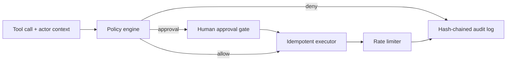

# Agent Ops Control Plane

[](https://github.com/bryllim/agent-ops-control-plane/actions/workflows/ci.yml)

A governed tool-execution layer for AI agents with least-privilege policy checks, approval gates, idempotency, tamper-evident audit records, and rate limits.

> Reference implementation published in 2026. The commit history reflects the actual build and publication timeline.

## Why it exists

As agents gain access to production systems, authorization must depend on the actor, tool, arguments, risk, and environment—not merely whether a function exists. This project models those controls as a small, inspectable policy engine.

## Architecture



Authorization is evaluated using registered tool risk, actor roles, and environment. Explicit denies override approvals and allows. Every decision is written to a redacted, tamper-evident audit chain.

## Quick start

```bash
python -m pip install -e .
agent-ops-demo
```

```python
from agent_ops import ActorContext, AgentControlPlane, Effect, PolicyEngine, PolicyRule, ToolCall, ToolSpec

plane = AgentControlPlane(
    (ToolSpec("lookup", lambda account: {"account": account}, risk=1),),
    PolicyEngine((PolicyRule("support reads", Effect.ALLOW, roles=frozenset({"support"})),)),
)
result = plane.execute(
    ToolCall("lookup", {"account": "ACME"}, idempotency_key="case-42"),
    ActorContext("support-agent", frozenset({"support"}), "development"),
)
```

## Governance controls

| Control | Behavior |
|---|---|
| Least privilege | No matching allow rule means deny |
| Precedence | Deny overrides approval; approval overrides allow |
| Human oversight | Approval is scoped to principal, tool, operation key, and expiry |
| Duplicate safety | Principal-scoped idempotency keys prevent repeated side effects |
| Abuse control | Per-principal sliding-window rate limits |
| Auditability | Sensitive fields are redacted and records are hash chained |

See [the architecture notes](docs/architecture.md) for threat boundaries and production extensions.

## Verification

```bash
PYTHONPATH=src python -m unittest discover -s tests -v
```

## Status

The initial release is an embeddable control-plane core with no external services required.

## License

MIT
